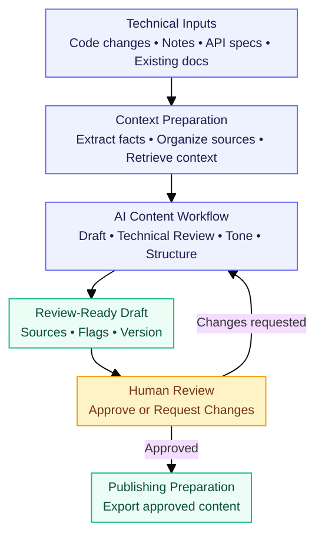
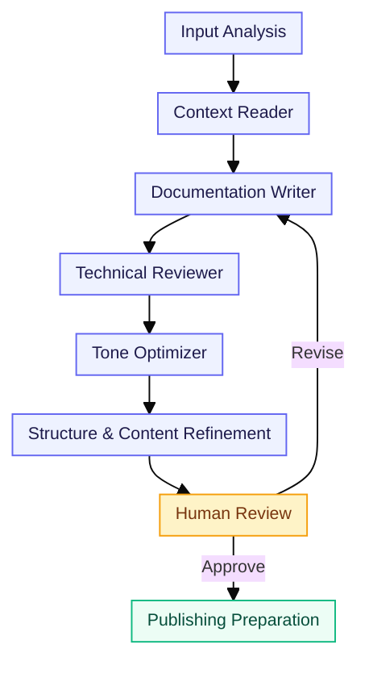
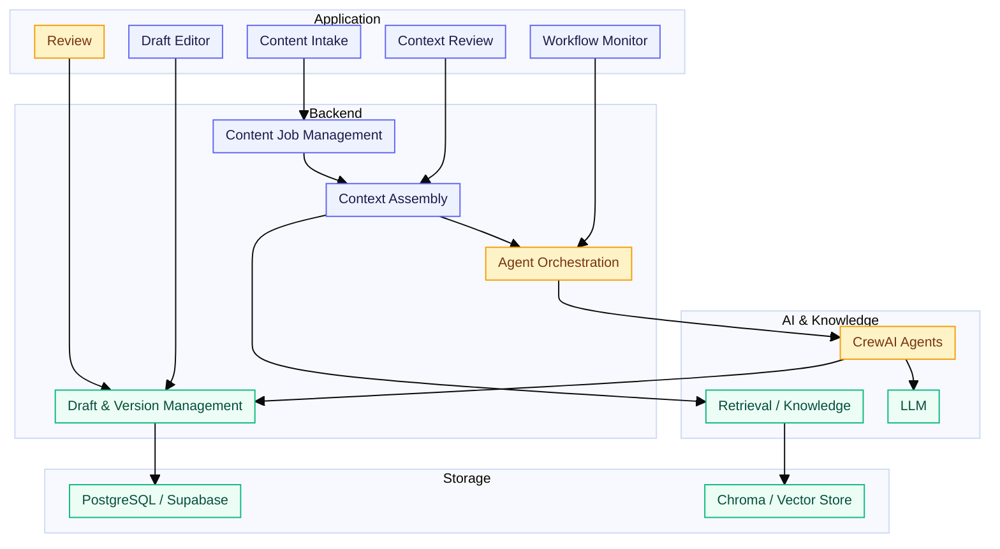
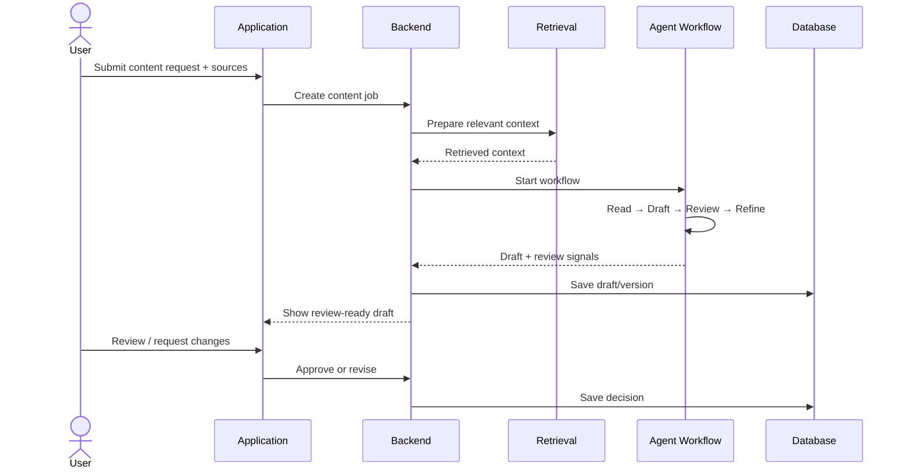
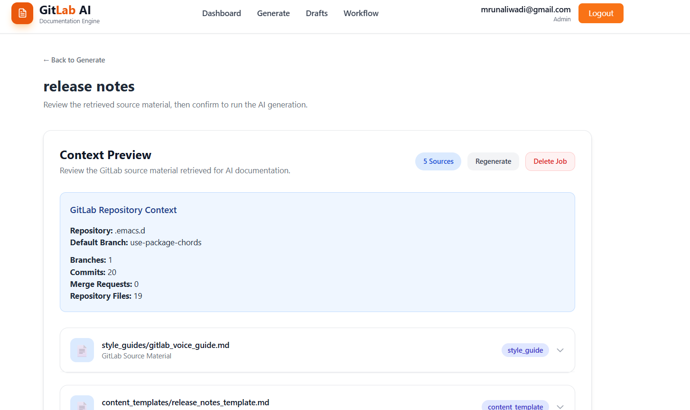
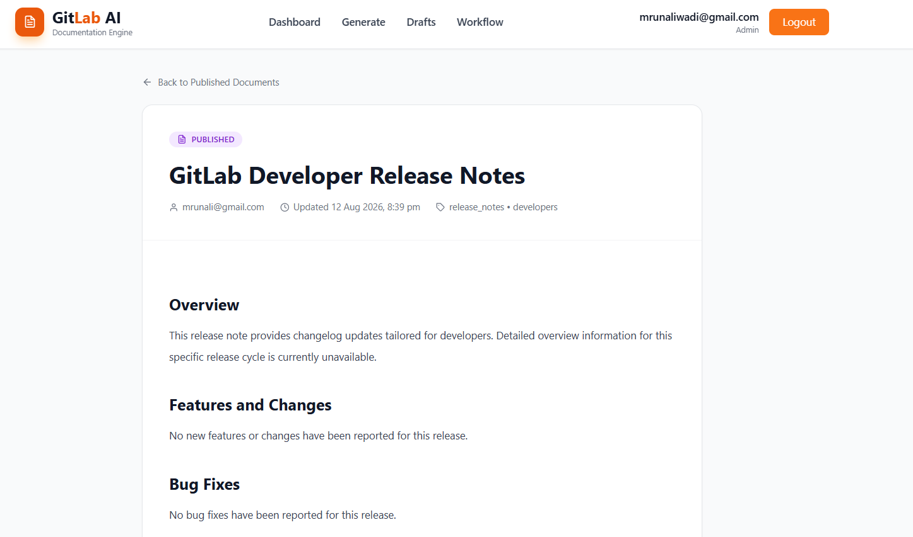

# GitLab AI Content & Documentation Engine

> Turn technical changes into source-grounded, review-ready documentation with a multi-agent AI workflow.

🚀 **[View Live Application](https://git-lab-ai-content-and-documentatio-seven.vercel.app/)**

---
## Overview

The **GitLab AI Content & Documentation Engine** helps teams transform technical inputs such as code changes, release notes, API specifications, issue context, and existing documentation into structured content drafts.

Instead of asking one AI agent to generate everything at once, the system separates the work into focused stages:

**Context → Draft → Technical Review → Tone & Structure → Human Review → Publish**

The goal is simple: **reduce documentation effort without removing technical and editorial control.**

---

## Why this project?

Technical changes often arrive before their documentation is ready. Engineers may have the code change, product teams may have release context, and writers may have existing documentation — but that information is spread across different sources.

This project brings those inputs together and creates a controlled path from technical change to review-ready content.

### What it helps with

- Converting technical changes into documentation drafts
- Keeping generated content grounded in supplied source material
- Reusing relevant existing documentation and knowledge
- Separating technical validation from writing and tone refinement
- Keeping a human reviewer in the approval loop
- Maintaining draft/version context throughout the workflow

---

## How it works



### Typical input

A content request can combine:

- Code changes / diffs
- Release or product notes
- API specifications
- Issue or feature context
- Existing documentation
- Content type and audience requirements

### Typical output

Depending on the request, the workflow can prepare:

- Release notes
- Technical documentation
- Developer-facing blogs
- Onboarding content
- API documentation

---

## Multi-Agent Workflow

Each stage has a focused responsibility instead of relying on a single generation step.



| Stage | Responsibility |
|---|---|
| **Context Reader** | Understands the supplied material, extracts relevant facts, and identifies missing context. |
| **Documentation Writer** | Creates the first structured draft using the prepared context. |
| **Technical Reviewer** | Checks whether technical claims remain supported by the available source material. |
| **Tone Optimizer** | Adjusts language for the selected audience and content type. |
| **Refinement** | Improves structure, clarity, headings, examples, and overall readability. |
| **Human Review** | Final review and approval before publishing. |

---

## Architecture



### Architecture responsibilities

**Frontend / UI**
- Collects content requests and source files
- Displays context and workflow progress
- Provides the draft and review experience

**Backend**
- Handles content jobs and inputs
- Builds the context package
- Coordinates the agent workflow
- Stores draft/version information

**AI layer**
- Runs specialized content agents
- Uses retrieved context when relevant
- Produces structured intermediate and final outputs

**Knowledge / Retrieval**
- Makes existing documentation, terminology, examples, and other approved context searchable

**Database**
- Stores operational records such as jobs, drafts, sources, review information, and workflow state

---

## Tech Stack

| Layer | Tools |
|---|---|
| **Backend API** | FastAPI |
| **AI Orchestration** | CrewAI |
| **LLM** | Gemini |
| **Retrieval / Vector Store** | ChromaDB |
| **Operational Database** | PostgreSQL / Supabase |
| **Database Access** | SQLAlchemy |
| **GitLab Integration** | python-gitlab |
| **Frontend Framework** | Next.js 14, React 18 |
| **Styling** | Tailwind CSS |
| **UI & Animation** | Framer Motion, Lucide React, React Icons |
| **Data Visualization** | Recharts |

---

## Project Structure

The repository is organized around the major application responsibilities rather than placing the entire workflow in a single module.

```text
gitlab-ai-content-engine/
│
├── 🧠 backend/                    # AI & API layer
│   ├── 🤖 agents/
│   │   └── crew.py                # Multi-agent workflow
│   │
│   ├── 🔎 retrieval/
│   │   └── chroma_store.py        # Knowledge retrieval
│   │
│   ├── 🔐 auth/                   # Authentication
│   ├── 🗄️ database/               # Database models & configuration
│   ├── ⚙️ services/               # Application services
│   ├── 📚 chroma_data/             # Knowledge-base data
│   │
│   ├── main.py                    # FastAPI entry point
│   ├── models.py                  # Application models
│   └── requirements.txt           # Backend dependencies
│
├── 🎨 frontend/                   # Web application
│
├── 📦 data/                       # Project knowledge & examples
│   ├── 📥 sample_inputs/          # Example technical inputs
│   ├── 📄 sample_docs/            # Example documentation
│   ├── ✍️ style_guides/            # Writing guidelines
│   └── 🧩 content_templates/      # Documentation templates
│
├── 🧪 tests/                      # Test suite
│   ├── functional_tests/          # Functional testing
│   ├── ai_output_tests/           # AI output validation
│   └── edge_cases/                # Edge-case testing
│
├── 📖 docs/                       # Documentation assets
│   └── readme_assets/             # README diagrams & images
│
├── 🔑 .env.example                # Environment template
└── 📘 README.md                   # Project documentation
```

---

## Getting Started

### 1. Clone the repository

```bash
git clone <repository-url>
cd gitlab-ai-content-engine
```

### 2. Create the backend environment

Create and activate a Python virtual environment for the backend.

```bash
cd backend
python3 -m venv venv
source venv/bin/activate
```

### 3. Install backend dependencies

```bash
pip install -r requirements.txt
```

### 4. Configure environment variables

Create a `.env` file from the provided example:

```bash
cp .env.example .env
```

Configure the required LLM, GitLab, email, and database variables.

**Do not commit .env, API keys, passwords, or access tokens to GitHub.**

### 5. Index the knowledge base

Prepare the project knowledge for retrieval:

```bash
python -m retrieval.ingest_knowledge
```

### 6. Start the Backend

Start the FastAPI backend from the `backend` directory:

```bash
python3 -m uvicorn main:app --reload
```

### 7. Start the Frontend

Open a **new terminal** from the project root and start the frontend:

```bash
cd frontend
npm install
npm run dev
```

> If the frontend dependencies have already been installed, you can skip `npm install` and run `npm run dev`.

---

## Running the Application

With both services running:

```text
Frontend
   │
   │  HTTP Requests
   ▼
FastAPI Backend
   │
   ├── AI Agents
   ├── Chroma Retrieval
   ├── Supabase / PostgreSQL
   └── GitLab Integration
```

Open the **frontend** to use the application.

The FastAPI documentation can be used to inspect and test the backend API endpoints when running the project locally.

---

## Configuration

Create a local `.env` file using `.env.example`.

| Variable | Purpose |
|---|---|
| `GEMINI_API_KEY` | Gemini API key used by the AI workflow |
| `GOOGLE_API_KEY` | Google API key where required by the configured AI services |
| `DATABASE_URL` | PostgreSQL / Supabase connection URL |
| `GITLAB_URL` | GitLab API base URL, for example `https://gitlab.com/api/v4` |
| `GITLAB_TOKEN` | GitLab personal/project access token used for GitLab API access |
| `BREVO_API_KEY` | Brevo API key used for transactional email delivery |
| `BREVO_SENDER_EMAIL` | Verified sender email address used for application emails |
| `FRONTEND_URL` | Frontend URL used when generating password-reset links |

### Email & Authentication

The application uses Brevo for transactional email delivery.

Email functionality includes:
- Signup verification codes
- Password reset emails
- Password reset links

For the live application, email delivery is configured through Brevo using a verified sender email address.

For local development, configure:
- `BREVO_API_KEY`
- `BREVO_SENDER_EMAIL`

For security, real API keys and credentials must not be committed to GitHub.

### Security

Keep real credentials only in `.env` or the deployment platform's secret manager.

**Never commit:**

- API keys
- Database passwords
- GitLab tokens
- Brevo API keys
- Production `.env` files

The `.env.example` file should contain variable names and safe placeholders only.

---

## Core Workflow in the Application



---

## Source Grounding & Human Review

A central design principle is that generated content should remain connected to the supplied technical context.

The workflow therefore separates:

**source/context preparation → generation → technical checking → refinement → human approval**

This helps reduce unsupported claims and makes it easier for a reviewer to understand where the generated content came from.

AI generation is not treated as the final publishing decision.

---

## Screenshots

### 1. Home / Product Overview


### 2. Application Dashboard


### 3. Generate Documentation


### 4. Context Preview / Source Grounding


### 5. Generated Documentation / Release Notes

---

## Project Status

🚀 **Deployed**

The application is deployed and available through the live application link above.

---

## Contributors ⭐

This project was developed collaboratively by:

| Contributor | Role / Contribution |
|---|---|
| Himanshu Shende | Project Development |
| Himanshu Gupta | Project Development |
| Aparna Nale | Project Development |
| Darshan Mathpal| Project Development |
| Surya Rohila | Project Development |
| Mrunali Wadi | Project Development |

All contributors participated in the development, testing, documentation, and refinement of the project.

---

<p align="center">
  <strong>Technical Change → Context → AI Workflow → Human Review → Documentation</strong>
</p>